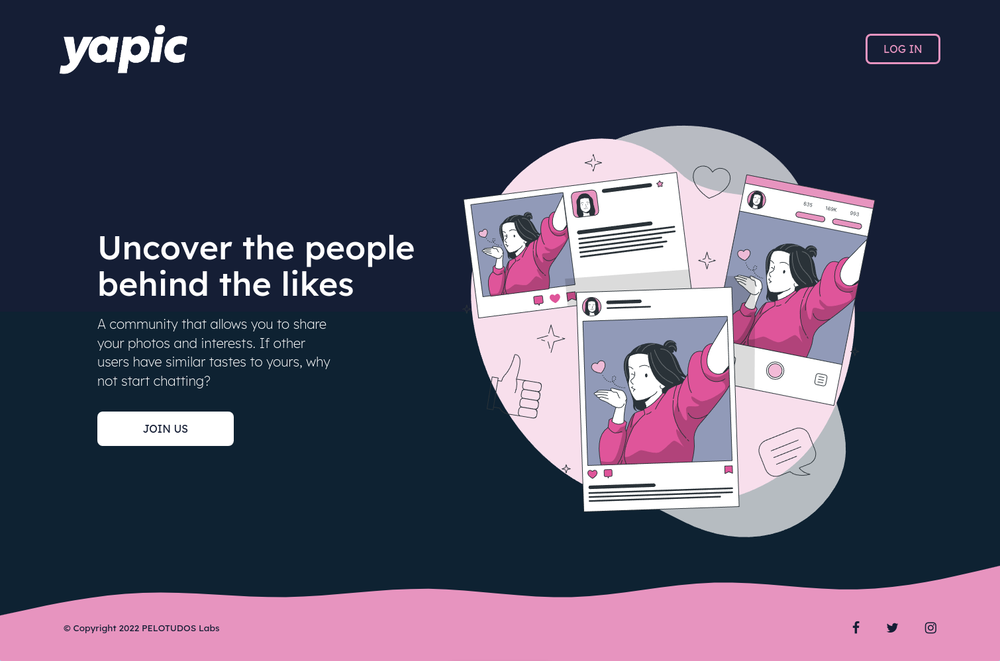

<p align="center">

</p>

<h1 align="center">yapic</h1>

**yapic** is a photo-sharing community which helps users connect based on the type of photos they upload (tags) and their similar interests (shortlist). When users start to upload photos and create a collection, the app will match them with potential new friends based on their common likes. They will have the possibility to see their user match profiles and get in touch through a form (sender username and email is shared in submit).

## User Stories

- **Error 4xx**- As a user, I want to see a clear error page when it doesn't exist/has restricted access so I know I probably made a mistake.
- **Error 5xx** -  As a user, I want to see a clear error page when problems are generated by the server so I know that is not my fault.
- **index/home** - As a user, I want to seamless access to the index/home so I know I'm the right place to begin the flow.
- **signup** - As a user, I want to signup in a secure and easy way on the webpage so I can start using the app.
- **login** - As a user, I want to be able to log in on the webpage so I can see my personal account.
- **logout** - As a user, I want to be able to log out from the webpage so I can make sure no one can access my personal account.
- **edit profile** - As a user, I want to be able to edit my profile so I can modify my personal data.
- **create post** - As a user, I want to create and share posts through pics easily so I have a personal collection and stay in touch with similar profiles.
- **profile of match** - As a user, I want to connect with other similar profiles with accurate interests so I can find and meet new people.
- **contact match** - As a user, I want to reach easily and quickly the profiles with similar interests so I can increase my network and meet new people.

## Server Routes/Views:

|**Method**    |    **View**           |    **Route**     |   **Description**       |          **Request - Body**                     |
|--------------|-------------------|------------------------|-----------------------------------|---------------------|
|`GET`         |   `index` or `home`            |      `/`               | Main page route for `ìndex` or `home` view. If logged redirect to `/home/user/:userid`  |   {req.session.userID} |
|`GET`         | `signup`            |    `/signup`           | Render `signup`form view          |                     |
|`POST`        |  `home`           |    `/signup`           | Send signup data to server and creates an user in DB. Then redirect to `/home/:userId`                                   |          {username, email, password}           |
|`GET`         |  `login`           |      `/login`          | Render `login`form view           |                     |
|`POST`        |   `home`          |      `/login`          | Send login data to server and redirect to `home`     | {email, password}            |
|`GET`         |   `home`          |      `/home/:userId`           | Render `home`view with personalization and potential profile matches                | {req.session.userID}    |
|`GET`        |    `home`         |      `/post/new`     | Render `post-creation`view  |  |
|`POST`        |    `post-creation`         |      `/post/new`     | Sends ObjID of the post that user do (upload photo with all fields). Then redirect `/home/user/:userId`   | {req.session.userID, req.file.path} |
|`GET`        |     `match-profile`          |      `/match/:matchId`    | Render `match`view   | {req.session.matchID} |
|`POST`        |     `match-profile`          |      `/match/:matchId`    | Render modal for contact match   |  |
|`GET`         |     `profile`        |      `/profile/:userId`        | Render `profile`view             | {req.session.userID                    |
|`POST`        |    `profile`         |      `/profile/:user:id` | Send the data updated by the user to the DB. Then render `profile`view  | {req.session.userID, name, age, genre, interests, country, req.file.path}  |
|`GET`        |    `home`         |      `/profile/:userId` | Render `home`view  |   |

### Backlog
| Method | Route | Description |
|--------|-------|-------------|
| `GET` | `/inbox` | Render inbox messages|

## Models

### User

```javascript
{
username: String
password: String
email: String
age: String
genre: [Strings]
country: String
interests: [Strings]
userPhotoUrl: String
posts: ObjectId 
}
```
### Post

```javascript
{
postPhotoUrl: String
owner: ObjectId 
title: String
description: String
tags: [Strings]
date: Date
}
```
## Links

### Deployment
<a href="https://yapic.cyclic.app/">
  
</a>

### Contributors
<div style="display: flex; gap: 0.5rem">
<a href="https://github.com/albertevieites">
  
</a>

<a href="https://github.com/pablodellacassa">
  
</a>
</div>